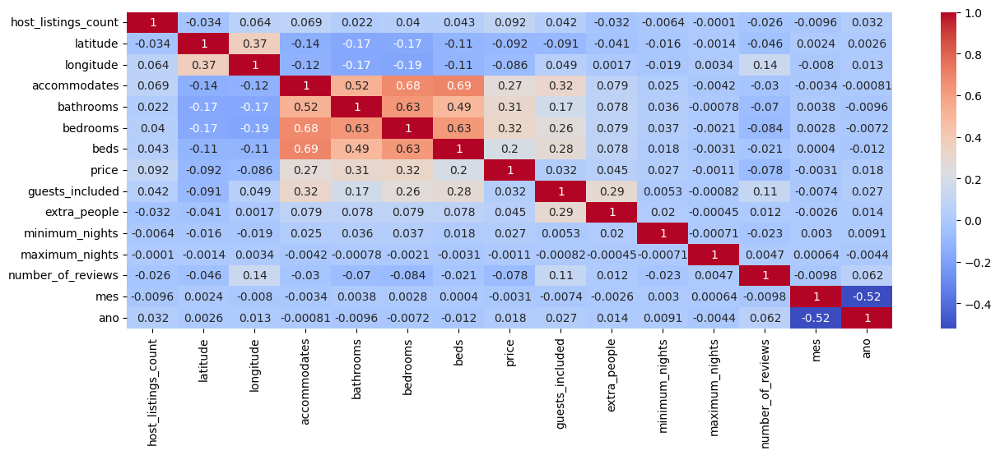

# Previsão de Preços Airbnb Rio de Janeiro


[](https://www.python.org/downloads/)
[](https://pandas.pydata.org/)
[](https://scikit-learn.org/)

## Visão Geral do Projeto

Este projeto implementa um pipeline completo de machine learning para prever preços de aluguéis no Airbnb no Rio de Janeiro. Utilizando dados históricos de abril/2018 a maio/2020, desenvolvemos um modelo preditivo que auxilia hosts a precificarem seus imóveis e ajuda inquilinos a avaliarem se um preço está adequado ao mercado.

### Principais Objetivos
- Desenvolver um modelo de previsão preciso e interpretável
- Criar visualizações interativas para exploração dos dados
- Disponibilizar uma ferramenta de consulta via Streamlit

## Instalação

```bash
# Clone o repositório
git clone https://github.com/igorpedrozo27/previsao_preco_airbnb_RJ.git
cd previsao_preco_airbnb_RJ

# Crie um ambiente virtual (recomendado)
python -m venv venv
source venv/bin/activate  # Linux/Mac
venv\\Scripts\\activate   # Windows
```

## Como Executar o Projeto

### Treinamento do Modelo
```python
# Execute o notebook de treinamento
jupyter notebook "Solução Airbnb Rio.ipynb"

# Ou execute via script
python "Previsao_Preco_Airbnb.py"
```

### Interface Web (Streamlit)
```bash
streamlit run Deploy_Previsao_Preco_Airbnb.py
```
## Etapas
- Contextualização
- ETL (Extract, Transform and Load)
- Análise Exploratória
- Encoding
- Escolha das Métricas de Avaliação dos Modelos
- Escolha e teste dos Modelos de Previsão
- Avaliação do Melhor Modelo
- Ajustes Finos
- Conclusão

## Dados Utilizados

O dataset contém informações mensais de imóveis listados no Airbnb Rio de Janeiro, incluindo:

- Características do imóvel (tipo, quartos, amenidades)
- Localização (bairro, latitude, longitude)
- Preços diários
- Reviews e ratings
- Disponibilidade
- Regras e políticas

Fonte dos dados: [Kaggle - Airbnb Rio de Janeiro](https://www.kaggle.com/allanbruno/airbnb-rio-de-janeiro)

## Expectativas Iniciais

- Sazonalidade pode ser um fator importante, visto que meses como Dezembro costumam ter um aumento significativo na demanda por imóveis por temporada no RJ.
- No Rio de Janeiro, a localização pode mudar completamente as características do lugar (segurança, beleza natural, pontos turísticos) e por isso deve ter uma forte influência no preço.

## Bibliotecas Utilizadas
```python
import pandas as pd # biblioteca para análise manipulação de dados
import pathlib as pl # biblioteca que permite percorrer arquivos no computador
import numpy as np # biblioteca para arrays e operações matemáticas
import seaborn as sns # biblioteca gráfica de visualização de dados
import matplotlib.pyplot as plt # biblioteca gráfica de visualização de dados
import plotly.express as px # biblioteca gráfica de visualização de dados

# bibliotecas de machine learning, modelos de previsão e avaliadores de performance dos modelos. 
from sklearn.metrics import r2_score, mean_squared_error
from sklearn.linear_model import LinearRegression
from sklearn.ensemble import RandomForestRegressor, ExtraTreesRegressor
from sklearn.model_selection import train_test_split
```

## Visualizações

### Matriz de Correlação das Features
```python
plt.figure(figsize=(15,5))
sns.heatmap(df_base_airbnb.corr(numeric_only=True), annot=True, cmap='coolwarm')
```

### Mapa de Calor de Preços
```python
amostra = df_base_airbnb.sample(n=50000)
centro_mapa = {'lat':amostra.latitude.mean(), 'lon':amostra.longitude.mean()}
mapa = px.density_map(amostra, lat='latitude', lon='longitude',z='price', radius=5,
                        center=centro_mapa, zoom=10,
                        map_style='open-street-map',)
mapa.show()
```


### Outras Visualizações
- Diagramas de Caixa, Histogramas e Gráfico de Barras para Análise Exploratória
- Importância das variáveis no modelo

## Modelos de Previsão

Implementamos e comparamos os seguintes algoritmos:

- Extra Trees Regressor (melhor performance)
- Random Forest
- Regressão Linear (baseline)

## Métricas de Avaliação

| Modelo | R² | RMSE |
|--------|-----|------|
| Extra Trees (pós ajuste) | 0.9757 | 41.27 |
| Extra Trees | 0.9756 | 41.34 |
| Random Forest | 0.9734 | 43.15 |
| Linear Regressor | 0.33 | 216.64 |


## Melhorias Futuras

1. Implementar feature engineering mais sofisticada
2. Adicionar dados mais recentes
3. Desenvolver API REST
4. Incluir análise de sentimento das reviews
5. Otimizar hiperparâmetros via Optuna


## Como Contribuir

1. Faça um fork do projeto
2. Crie sua feature branch (`git checkout -b feature/AmazingFeature`)
3. Commit suas mudanças (`git commit -m 'Add some AmazingFeature'`)
4. Push para a branch (`git push origin feature/AmazingFeature`)
5. Abra um Pull Request

## Agradecimentos

- Allan Bruno pelo dataset no Kaggle e projeto que inspirou este.
- Comunidade Hashtag Treinamentos
- Comunidade do Airbnb Rio de Janeiro