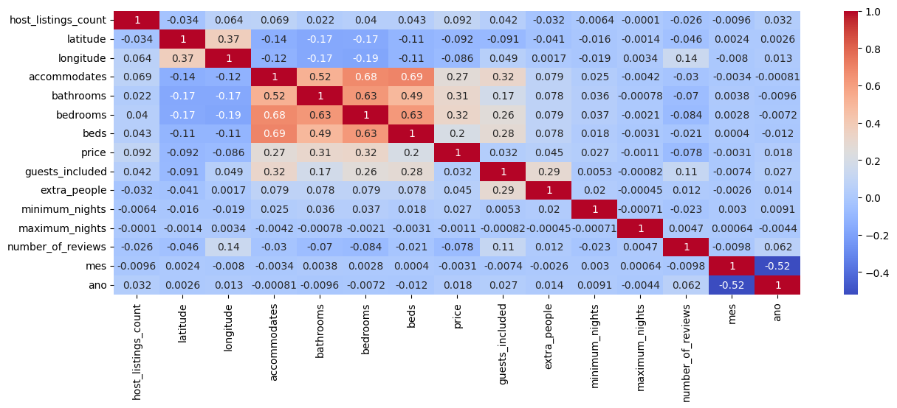
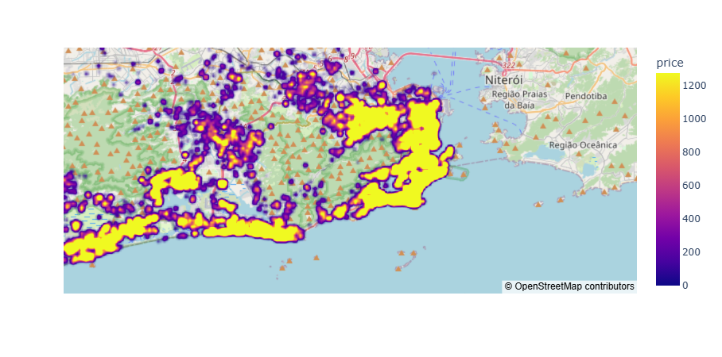

# Airbnb Price Prediction - Rio de Janeiro

[](https://www.python.org/downloads/)
[](https://pandas.pydata.org/)
[](https://scikit-learn.org/)

## Project Overview

This project implements a complete machine learning pipeline to predict Airbnb rental prices in Rio de Janeiro. Using historical data from April 2018 to May 2020, we developed a predictive model that helps hosts price their properties accurately and assists guests in evaluating whether a listing’s price is fair compared to the market.

### Key Objectives
- Build an accurate and interpretable prediction model  
- Create interactive visualizations for data exploration  
- Provide a user-friendly consultation tool using Streamlit  

## Installation

```bash
# Clone the repository
git clone https://github.com/igorpedrozo27/previsao_preco_airbnb_RJ.git
cd previsao_preco_airbnb_RJ

# Create a virtual environment (recommended)
python -m venv venv
source venv/bin/activate  # Linux/Mac
venv\Scripts\activate   # Windows
```

## How to Run the Project

### Model Training

```python
# Run the Jupyter notebook
jupyter notebook "Solução Airbnb Rio.ipynb"

# Or run the training script
python "Previsao_Preco_Airbnb.py"
```

### Web Interface (Streamlit)

```bash
streamlit run Deploy_Previsao_Preco_Airbnb.py
```

## Pipeline Steps

- Project context and goals  
- ETL (Extract, Transform, Load)  
- Exploratory Data Analysis  
- Feature encoding  
- Selection of evaluation metrics  
- Model selection and testing  
- Best model evaluation  
- Fine-tuning  
- Conclusion  

## Dataset Description

The dataset contains monthly Airbnb listings in Rio de Janeiro, including:

- Property characteristics (type, bedrooms, amenities)  
- Location data (neighborhood, latitude, longitude)  
- Daily pricing  
- Reviews and ratings  
- Availability  
- Rules and policies  

**Data Source:** [Kaggle - Airbnb Rio de Janeiro](https://www.kaggle.com/allanbruno/airbnb-rio-de-janeiro)

## Initial Insights

- **Seasonality** is expected to be important, especially during peak months like December.  
- In Rio de Janeiro, **location has a strong impact on price**, driven by factors like safety, natural beauty, and tourist attractions.

## Libraries Used

```python
import pandas as pd
import pathlib as pl
import numpy as np
import seaborn as sns
import matplotlib.pyplot as plt
import plotly.express as px

from sklearn.metrics import r2_score, mean_squared_error
from sklearn.linear_model import LinearRegression
from sklearn.ensemble import RandomForestRegressor, ExtraTreesRegressor
from sklearn.model_selection import train_test_split
```

## Visualizations

### Feature Correlation Matrix

```python
plt.figure(figsize=(15,5))
sns.heatmap(df_base_airbnb.corr(numeric_only=True), annot=True, cmap='coolwarm')
```



### Price Density Heatmap

```python
sample = df_base_airbnb.sample(n=50000)
map_center = {'lat': sample.latitude.mean(), 'lon': sample.longitude.mean()}
mapa = px.density_map(sample, lat='latitude', lon='longitude', z='price', radius=5,
                      center=map_center, zoom=10, map_style='open-street-map')
mapa.show()
```



### Other Visuals

- Box plots, histograms, and bar charts for data exploration  
- Feature importance rankings

## Regression Models

The following models were implemented and compared:

- **Extra Trees Regressor** (best performance)  
- **Random Forest**  
- **Linear Regression** (baseline model)

## Evaluation Metrics

| Model                     | R²     | RMSE   |
|--------------------------|--------|--------|
| Extra Trees (tuned)      | 0.9757 | 41.27  |
| Extra Trees              | 0.9756 | 41.34  |
| Random Forest            | 0.9734 | 43.15  |
| Linear Regression        | 0.33   | 216.64 |

## Future Improvements

1. Implement more advanced feature engineering  
2. Add updated data  
3. Develop a REST API  
4. Include sentiment analysis from user reviews  
5. Tune hyperparameters using Optuna  

## How to Contribute

1. Fork the repository  
2. Create your feature branch: `git checkout -b feature/AmazingFeature`  
3. Commit your changes: `git commit -m 'Add some AmazingFeature'`  
4. Push to your branch: `git push origin feature/AmazingFeature`  
5. Open a Pull Request  

## Acknowledgments

- Allan Bruno for the original Kaggle dataset and project inspiration  
- Hashtag Treinamentos community  
- Airbnb Rio de Janeiro user community